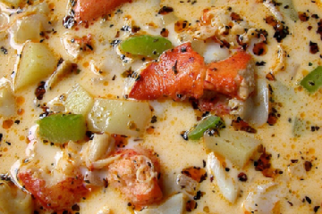

# Manhattan seafood chowder

**Serves:** 4

## Ingredients
- 60 grams butter
- 3 bacon slices (chopped)
- 2 onions (chopped)
- 2 garlic cloves (finely chopped)
- 2 celery stalks (sliced)
- 3 potatoes (diced)
- 3 teaspoons thyme (chopped)
- 1.25 litres fish stock
- 1 kg baby clams
- 1 tablespoon tomato purée
- 400 grams tinned tomatoes (chopped)
- 375 grams skinless cod fillets (cut into cubes)
- 12 large prawns (peeled and de-veined, tails intact)
- 2 tablespoons flat leaf parsley (chopped)

## Method
1. Wash the clams thoroughly, discarding any that have broken shells or fail to close when you tap them.
1. Melt the butter in a saucepan over a low heat.
1. Add the bacon, onion, garlic and celery and cook, stirring occasionally for 5 minutes or until soft.
1. Add the potato, thyme and 1 litre of the stock to the saucepan and bring to the boil.
1. Reduce the heat to low and simmer, covered, for 15 minutes.
1. Pour in the remaining stock and bring to the boil.
1. Add the clams, cover and cook for 3 - 5 minutes, or until they open.
1. Discard any clams that do not open.
1. Drain the clam liquor through a wet muslin-lined sieve into a clean bowl, and pour back into the soup.
1. Pull most of the clams out of their shells, leaving a few intact to garnish, and set aside.
1. Stir the tomato purée and chopped tomatoes into the soup and bring back to the boil.
1. Add the fish, clams and prawns and simmer over a low heat for 3 minutes, or until the seafood is cooked.
1. Season and stir in the parsley.
1. Serve with the clams in their shells scattered over the soup.