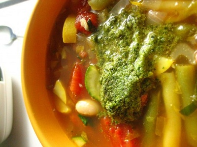

# Minestrone with pesto

**Serves:** 6

## Ingredients
- 125 grams dried borlotti beans
- 1 large onion (coarsely chopped)
- 2 garlic cloves
- 3  tablespoons flat leaf parsley (freshly chopped)
- 60 grams pancetta (chopped)
- 3 tablespoons olive oil
- 1 celery stick (halved length-ways then cut into 1 cm slices)
- 1 carrot (halved length-ways then cut into 1 cm slices)
- 1 potato (diced)
- 2 teaspoons tomato purée
- 400 grams tinned tomatoes (chopped)
- 6 fresh basil leaves (torn)
- 2 litres stock (beef, chicken or vegetable)
- 2 thin zucchini (cut into 1.5 cm slices)
- 60 grams green beans (cut into 4 cm lengths)
- 80 grams sliverbeat leaves (shredded)
- 75 grams ditalini (or other small pasta)

### Pesto
- 30 grams fresh basil leaves
- 20 grams pine nuts (toasted)
- 2 garlic cloves
- 100 ml olive oil
- 25 grams Parmesan (freshly grated)

## Method
1. Put the beans in a large bowl, cover with water and soak overnight. Drain and rinse under cold water.
1. Place the onion, garlic, parsley and pancetta in a food processor and process into a fine paste.
1. Heat the oil in a large saucepan, add the pancetta mixture and cook over a low heat, stirring occasionally for about 8 - 10 minutes.
1. Add the celery, carrot and potato and cook for 5 minutes, then stir in the tomato paste, tomato, basil and the borlotti beans.
1. Season with freshly ground black pepper.
1. Add the stock and bring slowly to the boil.
1. Cover and simmer for 1 hour and 30 minutes, stirring occasionally.
1. Season to taste and add the zucchini, green beans, silverbeet and the pasta.
1. Simmer for 8 - 10 minutes, or until the vegetables and pasta are al dente.

### To make the pesto
1. Place the basil, garlic and pine nuts in a food processor, and add the olive oil. 
1. Purée for about 10 seconds until the mixture is smooth.
1. Transfer to a bowl and fold in the cheese. 
1. Season with salt and set aside.

### To serve
1. Serve the soup in bowls with the pesto on top, with warm fresh bread or rolls.