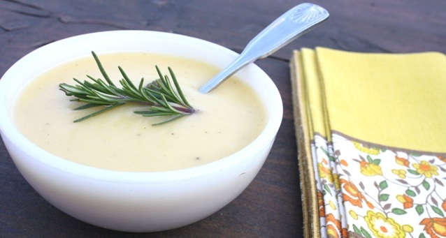

# Potato and garlic soup

**Serves:** 6

## Ingredients
- 2 garlic bulbs
- 500 grams potatoes (peeled)
- 1 onion (finely chopped)
- 2 onions (halved)
- 2 litres stock (vegetable or chicken)
- chopped chives to serve (or a sprig of rosemary)

## Method
1. Separate the garlic bulbs into cloves and gently crush with the flat side of a knife to split the skin.
1. Peel the cloves and cut in half.
1. Chop the potatoes into small cubes.
1. Heat the olive oil in a large frying pan, add the onion and garlic and cook over a medium-low heat for 5 - 10 minutes, or until the garlic is very lightly golden.
1. Add the potato and cook over a low hear for 5 minutes.
1. Add the stock and simmer for 40 - 45 minutes, or until the garlic is very soft and the stock has reduced. Set aside to cool slightly.
1. Process the soup in batches in a food processor until smooth.
1. Return to the pan and taste for seasoning.
1. Reheat gently before serving, and serve with a sprinkle of chopped chives.