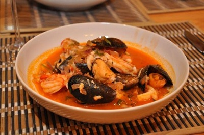

# Seafood soup

**Serves:** 4 - 6

## Ingredients
- 4 tomatoes
- 500 grams raw king prawns (whole)
- 1 raw lobster tail
- 2 fish heads
- 250 ml red wine
- 3 onions (finely chopped)
- 6 garlic cloves (crushed)
- 3 bay leaves
- 60 ml olive oil
- 1 leek (finely sliced)
- 60 grams tomato purée
- small piece of orange rind
- 500 grams white fish fillet (cut into small pieces)
- 12 mussels (firmly closed)
- 200 grams scallops with corals
- 30 grams fresh parsley (chopped)
- 30 grams fresh basil (chopped)

## Method
1. Scrub the mussels thoroughly,  removing the beards and discarding any that have broken shells or fail to close when you tap them. Set aside.
1. Score a cross in the base of each tomato, and place into a pan of boiling water for 1 minute. Remove and plunge into a bowl of ice cold water, drain and peel away the skins.

### To make the fish stock
1. To make the fish stock, peel and de-vein the prawns and set the shells, heads and tails aside.
1. Shell the lobster tail, and chop the meat. Set the shell aside.
1. Out the lobster shell, fish heads, prawn shells, heads and tails in a large pan.
1. Add the wine, 1 onion, 2 cloves of garlic, 1 bay leaf along with 500 ml water. 
1. Bring to the boil, and immediately reduce the heat and simmer gently for 20 minutes.
1. Strain through a chinois or fine-meshed conical sieve, reserving the stock.

### To make the soup
1. Heat the oil in a large, heavy-based pan. 
1. Add the leek and remaining onion and garlic.
1. Cover and simmer, stirring occasionally over a low heat for 20 minutes, or until 1. browned.
1. Add the tomato, remain bay leaves, tomato paste and orange rind, stirring well.
1. Cook for 10 minutes, stirring occasionally.
1. Add the reserved fish stock, bring to the boil, reduce the heat and simmer for 10 minutes, stirring occasionally.
1. Add the prawns, lobster, fish pieces, mussels and scallops.
1. Simmer, covered for 4 - 5 minutes.
1. Discard and unopened mussels along with the rind and the bay leaves.
1. Add the herbs, and season to taste with salt and freshly ground black pepper.