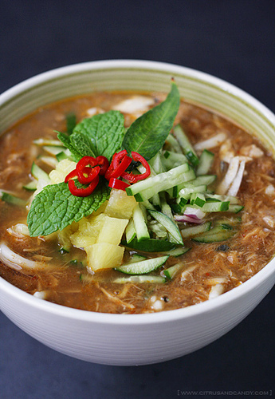

# Shellfish Laksa

*A laksa is a soupy Malaysian strew of fish, poultry, meat or vegetables with noodles. Laksas are often very hot and are cooled by adding coconut milk.*

**Serves:** 4

## Ingredients
- 3 fresh medium hot red chillies (de-seeded and chopped)
- 5 garlic cloves
- 1 teaspoon mild paprika
- 2 teaspoon shrimp paste
- 1½ tablespoon chopped fresh root ginger
- 7 small red shallots
- 25 grams fresh coriander (with roots)
- 45 ml groundnut oil
- 1 teaspoon fennel seeds (crushed)
- 2 fennel bulbs (cut into thin wedges)
- 600 ml fish stock
- 300 grams thin vermicelli rice noodles
- 450 ml coconut milk
- juice of 1 - 2 limes
- 45 ml Thai fish sauce
- 450 grams white fish fillet
- 20 large prawns (peeled and de-veined)
- small bunch fresh basil
- 2 spring onions (finely sliced)

## Method
1. Process the chillies, garlic, paprika, shrimp paste, ginger and two of the shallots to a paste in a food processor.
1. Remove the roots and stems from the coriander, wash and pat dry with kitchen paper.
1. Add them to the paste.
1. Chop and reserve the coriander leaves.
1. Add 1 tablespoon of oil to the paste and process again until fairly smooth.
1. Scrape into a bowl.
1. Head the remaining oil in a large pan.
1. Add the remaining shallots, with the fennel seeds and fennel wedges.
1. Cook until lightly browned, then add 3 tablespoons of the paste and stir-fry for 1 - 2 minutes.
1. Pour in the fish stock and bring to the boil.
1. Reduce the heat to low and simmer for 8 - 10 minutes.
1. Meanwhile, cook the vermicelli rice noodles, drain thoroughly and set aside.
1. Pour the coconut milk into the pan of shallots, stirring constantly to prevent sticking, then add the juice of 1 lime with 2 tablespoons of the fish sauce.
1. Stir well to combine, and bring to a gentle simmer.
1. Taste for seasoning, adding more coconut milk, zlime juice or fish sauce as necessary.
1. Add the fish to the pan.
1. Cook for 2 - 3 minutes, then add the raw prawns and cook for a further 3 - 4 minutes or until they just turn pink.
1. Chop most of the basil and add it to the pan with the reserved coriander leaves.
1. Divide the noodles among 4 - 5 deep bowls, then ladle in the stew.
1. Sprinkle with spring onions and the remaining whole basil leaves.
1. Serve at once.