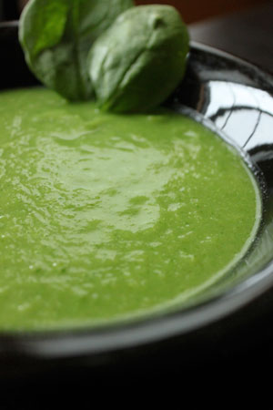

# Spinach and Fennel soup

*This delicious and hearty soup is surprisingly rich yet elegant at the same time. The two main ingredients of spinach and fennel have unique and potent tastes, yet blend together perfectly. Take care not to overcook this soup, as the wonderful fresh colour and flavours will diminish. Serve this soup with a loaf of good fresh bread, and a generous helping of butter.*

**Serves:** 4

## Ingredients
- 60 grams unsalted butter
- 2 small onions
- 2 small fennel bulbs
- 1 small potato
- 1.75 litres of water
- 700 grams spinach
- 4 tablespoons double cream
- salt and pepper to taste

## Method
### Preparation
1. Very finely chop the onions.
1. Very finely chop the fennel bulbs.
1. Peel and chop the potato.
1. Wash the potato in water until all the starch has been removed.
1. Remove any excess stalk from the spinach, leaving only the leaves.
1. Plunge the spinach in cold water until perfectly clean.

### Making the soup
1. Melt the butter in a large casserole pot.
1. Over a low heat, fry the onion and fennel together very gently for about half an hour.
1. Add the potato to the pot, along with the water.
1. Simmer for about 20 minutes until the potato has been thoroughly cooked.
1. Stir the spinach into the soup and remove from the heat.

### Bringing the soup to the table.
1. Liquidize the soup in small batches until very smooth.
1. For a perfectly fine soup, push the soup through a fine meshed sieve or chinois.
1. Add a little cream to the soup, reheat gently and serve.