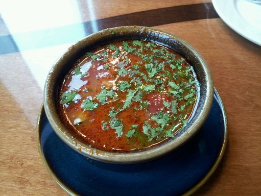

# Thai spicy sour soup

**Serves:** 4 - 6

## Ingredients
- 750 ml vegetable stock stock
- 2 tablespoons tom yum paste
- 2 cm piece galangal (peeled and cut into thin slices)
- 1 lemongrass stem (lightly crushed, and chopped into 4 lengths)
- 3 kaffir lime leaves
- 1 small red chilli (finely sliced)
- 200 grams button mushrooms (halved)
- 200 grams tofu (cut into 1.5 cm cubes)
- 200 grams pak choi (shredded)
- 2 tablespoons lime juice
- 1 handful coriander leaves

## Method
1. Place the stock, Tom Yum paste, lime leaves, chilli and 750 ml of water in a saucepan. 
1. Cover and bring to the boil, then immediately reduce the heat to low and simmer gently for 5 minutes.
1. Add the mushrooms, tofu and continue to simmer for a further 5 minutes, or until the mushrooms are tender.
1. Add the pak choi and simmer for another minute, or until wilted.
1. Remove the pan from the heat and stir in the lime juice and coriander leaves before serving.