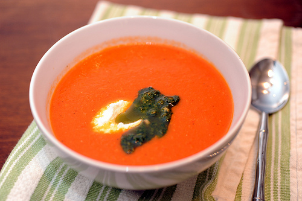

# Tomato Soup

*This soup stands up as either a start or a main course, and can either be served as a stew or as a purée. If serving as a purée, then adding a little cream at the end makes this soup wonderfully smooth. The real beauty of course is how simple it is to make, especially when served with fresh warm bread and topped with croûtons. 

This soup can be served as a vegetarian dish, by removing the bacon and substituting the chicken stock with vegetable stock.
*

**Serves:** 6 - 8

## Ingredients
- 3 onions (chopped)
- 3 carrots (cut into 5 mm dice)
- 3 celery sticks (cut into 5 mm dice)
- 50 ml olive oil
- 25 grams unsalted butter
- small bunch of fresh basil (chopped)
- small bunch of tarragon (chopped)
- 1 bay leaf
- 1 large garlic clove (crushed)
- 6 smoked back bacon rashers (rinded and chopped)
- 900 grams ripe tomatoes
- 750 ml chicken stock
- salt and freshly ground black pepper
- 1 tablespoon tomato purée

## Method
1. Score a cross in the base of each tomato, and place into a pan of boiling water for 1 minute. Remove and plunge into a bowl of ice cold water, drain and peel away the skins.
1. Sweat the onions, carrots and celery in the olive oil and butter for a few minutes.
1. Add the herbs, bay leaf and garlic and cook for a few more minutes.
1. Add the bacon and continue to cook for about 5 minutes until the vegetables are slightly softened.
1. Cut the tomatoes into quarters and then cut each quarter in half. 
1. Add the tomatoes to the pan, and cover, cooking gently for about 15 minutes, stirring occasionally to help the tomatoes break down.
1. When the tomatoes have softened, start to add the chicken stock, a ladle at a time, until it forms a looser consistency (The amount of stock added depends on how thick or thin the desired soup needs to be).
1. Leave the soup to cook for 20 minutes, on a slow, gentle bubble.
1. Check for seasoning, and add the tomato purée.
1. Remove the bay leaf.
1. If making a purée of the soup, allow to cool for a few minutes and add the soup to a blender and purée until it reaches the desired consistency. Add a little cream and return to the pan to heat through.