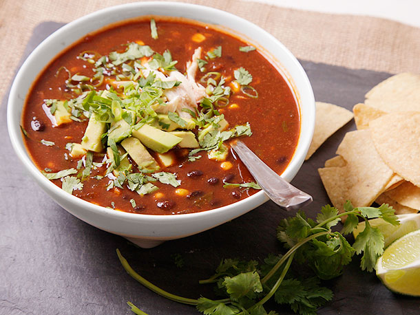

# Tortilla soup

*This is a classic Mexican soup, simple yet at the same time sophisticated. You can use the recipe below for a light fragrant soup, or add left-over bits of chicken for a hearty comforting variant. *

**Serves:** 4

## Ingredients
- 1.2 litres of chicken stock
- 1 onion
- 3 garlic cloves
- 4 -6 fresh tomatoes, skinned and seeded
- 6 corn tortillas
- 5 tablespoons of olive oil
- 1 - 2 very large dried chillies (seeds removed)
- 1 teaspoon smoked paprika
- 200 grams buffalo mozzarella
- 1 large ripe avocado
- 1 large lime
- 1 bunch fresh flat leaf parsley
- 1 bunch fresh coriander

## Method
### Preparation
1. Peel the onion, and cut into 6 pieces.
1. Dice the mozzarella into ½ cm pieces.
1. Remove the stone from the avocado, and peel.
1. Find 5 ramekins.
1. Chop the avocado into ½ cm pieces and place in a ramekin.
1. Cut the lime into wedges and place in a ramekin.
1. Finely chop the parsley and place in a ramekin.
1. Finely chop the coriander and place in a ramekin.

### Making the base
1. Put the onion and garlic in a large, heaving frying  pan and dry toast (stirring frequently) for 5 - 6 minutes over a medium heat.
1. Add the onions, paprika and garlic to a food processor, along with the tomatoes and purée.
1. Add the purée to a saucepan over a medium heat and reduce until thick.
1. Add the stock and simmer for about 25 minutes.
1. Season to taste.

### Frying the tortillas
1. Add the chilli to a dry frying pan and toast for about 30 seconds, taking care not to burn the chilli.
1. Cut the chilli into strips.
1. Cut the tortillas in half.
1. Cut each half into 2 cm strips.
1. Heat the oil in a saucepan until shimmering.
1. Add half the tortilla strips and fry, stirring constantly until the pieces are brown and crispy.
1. Remove the tortilla, and allow to dry on kitchen towel.
1. Repeat with the remaining tortilla.

### Bringing the soup to the table.
1. Divide the tortilla and chilli strips between 4 bowls.
1. Add the tomato broth to each bowl.
1. Arrange the 5 ramekins on a table along with the soup bowls.
1. Add cheese and avocado to the soup, with a squeeze of lime juice and garnish with parsley and coriander.