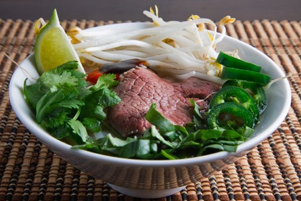

# Vietnamese beef soup

*Pho bo*

*This dish works best with raw beef that has been sliced paper thin, as it cooks in seconds when placed in the hot broth.*

**Serves:** 

## Ingredients
- 400 grams rump steak (frozen)
- half an onion
- 1 ½ tablespoons fish sauce
- 1 star anise
- 1 cinnamon stick
- pinch ground white pepper
- 1.5 litres beef stock
- 300 grams fresh thin rice noodles
- 3 spring onions (thinly sliced)
- 15 grams mint leaves
- 90 grams bean sprouts (washed and trimmed)
- 1 small white onion (thinly sliced)
- 1 small red chilli (thinly sliced)
- lemon wedges (to serve)

## Method
1. Slice the frozen beef as thinly as possible. If the beef begins to thaw, put it back in the freezer for 15 minutes.
1. Put the onion, fish sauce, star anise, cinnamon stick, pepper, stock and 500 ml of water in a large saucepan.
1. Bring to the boil, then reduce the heat, cover and simmer for 20 minutes.
1. Discard the onion, star anise and cinnamon stick.
1. Cover the noodles with boiling water and gently separate the strands. Drain and refresh under cold water.
1. Divide the noodles and spring onion among four deep bowls. Top with the beef, mint, bean sprouts, spring onion and chilli. Ladle the hot broth over the top and serve with the lemon wedges.