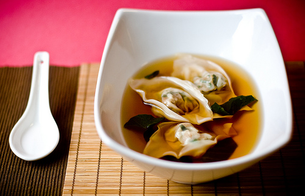

# Wuntun soup

*This is one of the most popular soups in southern China, and is equally popular in Chinese restaurants in the West. Ideally, soup wuntun should be stuffer savoury dumplings poached in clear water then served in a rich broth.*

**Serves:** 4 - 6

## Ingredients
- 30 wuntun skins
- 1 litre Chinese chicken stock

### For the filling
- 350 grams minced pork
- 1 tablespoon light soy sauce
- 2 teaspoons dry sherry
- 1 ½ tablespoons spring onions (finely chopped)
- 1 teaspoon sesame oil
- 1 egg white
- ½ teaspoon cornflour
- 1 teaspoon sugar
- ½ teaspoon salt

### For the garnish
- 1 tablespoon light soy sauce
- 1 tablespoon spring onions (finely chopped)
- 1 teaspoon sesame oil

## Method
1. Combine the filling ingredients in a large bowl and mix well.
1. Using a small spoon, put a small amount of filling in the centre of each wuntun skin.
1. Bring up the sides of the skin around the filling and pinch them together at the top so that the wuntun is well sealed. It should look like a small, filled bag.
1. Bring a large bot of water to the boil and place the wuntun in the water for 1 minute until they float to the top.
1. This poaching rids the wuntun of any excess flour and starch and will ensure that the soup itself is clean and has a clean texture.
1. Remove the wuntun with a slotted spoon and put them on a plate.
1. Bring the chicken stock to the boil in a large pot.
1. Add the cooked wuntun and the garnish ingredients.
1. Turn the heat to low and simmer for 2 minutes.
1. Serve in individual bowls.