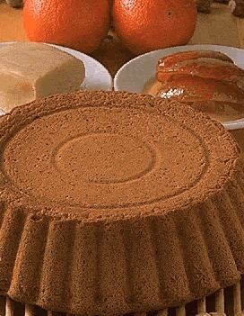

# Biscuit A L'Orange

*This biscuit can either be used as a sponge or plain biscuits.*

**Serves:** 8

## Ingredients
- 4 size 4 eggs
- 1 size 2 egg
- 85 grams ground almonds 
- zest of half an orange (finely chopped)
- 25 grams candied orange peel
- 130 grams sugar
- 85 grams flour
- 1 teaspoon butter (melted)
- 30 grams butter (for greasing)
- 1 pinch flour (for greasing)

## Method
1. Preheat the oven to 200°C
1. Separate the eggs, putting the yolks and whites in different bowls.
1. Add the ground almonds, chopped orange zest, candied peel and three-quarters of the sugar to the yolks and beat together until the mixture forms a ribbon.
1. Beat the whites until soft peaks form, then add the remaining sugar and beat until very stiff.
1. Using a flat, slotted spoon, fold one-third of the egg whites into the yolk mixture and blend thoroughly. 
1. Gently fold in the remaining whites. 
1. Just before the whites are completely incorporated, sift in the flour, stirring continuously. 
1. Stop stirring as soon as the flour is completely amalgamated.
1. Brush the inside of a tin or ring with the melted butter and coat lightly with flour. 
1. Place the ring on a baking sheet lined with baking parchment or buttered and floured greaseproof paper.
1. Gently pour in the sponge mixture and level the surface with a pastry scraper or palette knife.
1. Bake the sponge in the preheated oven for 25 minutes. 
1. As soon as it is cooked, turn it onto a wire rack and remove the outer ring.