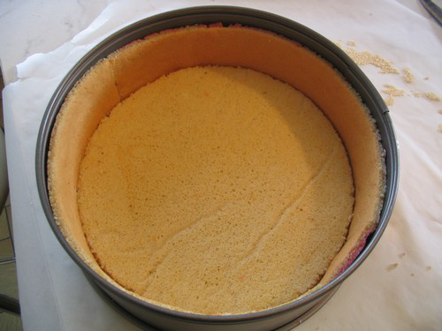

# Biscuit joconde

*Biscuit joconde is a very fine, delicate sponge which is used to make all kinds of desserts base on mousses and bavarois.*

**Serves:** 

## Ingredients
- 375 grams Tant pour tant
- 5 whole eggs
- 5 egg whites
- 25 grams sugar
- 40 grams butter (melted and cooled)
- 50 grams flour
- 30 grams butter

## Method
1. Preheat the oven to 250°C
1. Put the eggs and tant pour tant in the bowl of the mixer and beat at high speed for about 10 minutes, until the mixture forms a ribbon. 
1. Pour into a bowl and set aside.
1. Beat the egg whites until well risen, then add the sugar and beat faster for 1 minute.
1. Using a flat slotted spoon or spatula, fold the cooled butter, then the flour into the whole egg mixture. 
1. Mix in one-third of the egg whites until thoroughly blended, then fold in the rest, taking care not to over mix.
1. Using a palette knife, spread the sponge mixture over a sheet of baking parchment or lightly buttered and floured greaseproof paper, to a thickness of about 3 or 4 mm. 
1. Bake immediate in the very hot oven for 2-3 minutes. 
1. To test whether the sponge is cooked, touch it with your fingertips. 
1. It should not stick to your fingers, but be just firm, yet moist and on no account dry.
1. Slide the cooked sponge, still on the paper onto a wire rack. 
1. Remove the paper only just before using the sponge.