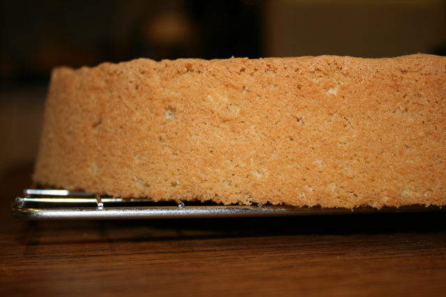

# Génoise nature (Genoise sponge)

*This sponge is generally baked the day before it is eaten. It is also the perfect sponge to use in either a traditional or chocolate trifle. For a chocolate sponge simply replace 50 grams of the flour with good quality cocoa powder.*

**Serves:** 18

## Ingredients
- 250 grams sugar
- 8 eggs     
- 250 grams flour
- 50 grams Clarified butter
- 30 grams butter (for greasing)
- 1 pinch flour (for greasing)

## Method
1. Preheat the oven to 190°C
Put the sugar and eggs in the bowl of a mixer and whisk immediately.
Set the bowl in a bain-marie and, still whisking, heat until the mixture reaches about 30°C
1. Remove the bowl of the bain-marie and beat the mixture at medium speed for 10 minutes, until well risen, then reduce the speed and beat for a further 10 minutes until the mixture cools and has a ribbon consistency.
1. Sift the flour and fold it gently into the mixture with a flat slotted spoon, taking care not to overwork it. 
1. Add the clarified butter.
1. Divide the mixture between the lightly buttered and floured tins or moulds and bake immediately in the oven.
1. Cooking time will vary according to the size of the mould you use. A 22 cm sponge will take 30 minutes, while a very large sponge can take an hour.
1. As soon as the sponge is cooked, invert it onto a wire rack and unmould. 
1. Give the cake one-quarter turn every 15 minutes until it has cooled, this will prevent it from sticking to the rack and spoiling.