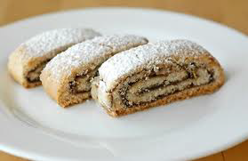

# Rolled biscuits

**Yield:** 22cm 

## Ingredients
- 4 eggs (separate out yolks)
- 3 extra egg yolks
- 85 grams sugar (sifted)
- 35 grams flour (sifted)
- 40 grams potato flour (sifted)

## Method
1. Preheat the oven to 220°C
Combine all of the egg yolks with two-thirds of the sugar, and beat until they form a ribbon.
1. Beat the egg whites in a mixer until they are well risen, then add the remaining sugar and beat at high speed for 1 minute until firm.
1. Using a flat slotted spoon, fold about one-third of the whites into the yolks until the mixture is perfectly blended. 
1. Tip in the remaining whites all at once and fold them very gently into the mixture. 
1. Before it is thoroughly blended, still mixing continuously scatter in the flour and the potato flour.
1. As soon as the mixture is homogeneous, stop mixing, or it will become heavy.
1. Using a piping bag fitted with a plain nozzle, which can be any size from 5 mm to 1.5 cm, depending on the desired shape. 
1. Alternatively use a ridged nozzle or a palette knife. 
1. Pipe or spread the mixture onto a sheet of baking parchment or lightly buttered and floured greaseproof paper.
1. Slide the paper onto a baking sheet and bake in the oven for about 6 minutes, if you are using the 5 mm nozzle. 
1. Allow for longer for a larger nozzle.
1. The cooked sponge should be about 5 mm thick. 
1. Invert it onto a tea towel and immediately and carefully peel off the paper. 
1. Fill and roll the sponge or assemble it in layers, alternating the sponge with flavoured cream.