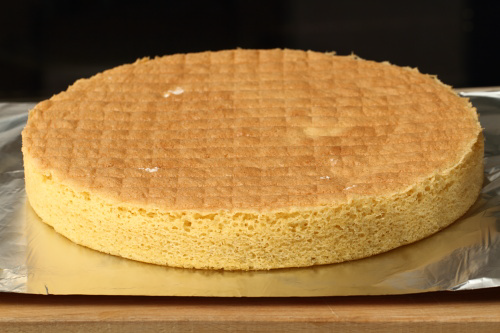

# Sponge base

**Yield:**  22cm

## Ingredients
- 6 eggs (separate out yolks)
- 180 grams flour (sifted)
- 190 grams sugar (sifted)

## Method
1. Preheat the oven to 190°C
1. Combine all of the egg yolks with two-thirds of the sugar, and beat until they form a ribbon.
1. Beat the egg whites in a mixer until they are well risen, then add the remaining sugar and beat at high speed for 1 minute until firm.
1. Using a flat slotted spoon, fold about one-third of the whites into the yolks until the mixture is perfectly blended. 
1. Tip in the remaining whites all at once and fold them very gently into the mixture. 
1. Before it is thoroughly blended, still mixing continuously, scatter in the flour. 
1. As soon as the mixture is homogeneous, stop mixing, or it will become heavy.
1. Pour the mixture into a lightly buttered and floured tin or flan ring and bake in the oven for 15-25 minutes, depending on the diameter of the mould, and therefore on the thickness of the sponge.
1. As soon as the sponge is cooked, invert it onto a wire rack. 
1. Rotate it one-quarter turn every 15 minutes until it has cooled to prevent it sticking to the rack.