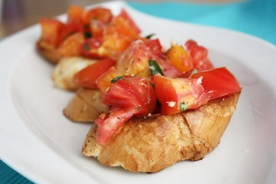

# Mediterranean Bruschetta

**Serves:** 4 - 6

## Ingredients
### Capsicum topping
- 1 yellow pepper
- 1 red pepper
- 1 green pepper

### Tomato and basil topping
- 2 ripe tomatoes
- 15 grams basil (freshly chopped)
- 1 tablespoon extra virgin olive oil
- Black pepper

### Bruschetta
- 12 slices crusty Italian bread
- 2 garlic cloves (halved)
- 80 ml extra virgin olive oil
- 1 tablespoon flat leaf parsley (chopped)
-  salt and freshly ground black pepper

## Method
### For the capsicum topping
1. Preheat the oven to 200°C.
1. Cut the tops off the peppers and remove the seeds and pith. Rub oil over the peppers, and place in the oven. Cook until the skins are blackened, and then remove and seal in 1. plastic food bags to sweat. 
1. Once cooled, pull the skin off with your fingers. Slice into strips.

### For the Tomato and basil topping
1. Chop the tomatoes into halves, and discard the seeds. 
1. Finely chop the tomatoes, and place in a bowl with the chopped basil. Season with freshly ground black pepper, and pour over the olive oil.

### To make the bruschetta
1. Toast the bread slices, and while still hot, rub gently with the cut side of a garlic clove. Drizzle with olive oil and season with salt and pepper.
1. Arrange the Capsicum topping on half of the bread slices, and sprinkle with parsley.
1. Arrange the tomato and basil topping on the remaining bread slices.
1. Serve immediately.
