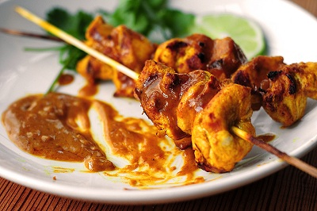

# Chicken satay

*Concertinas of tender chicken, served with chilli-flavoured peanut sauce, are irresistible. Garnish with sliced fresh red chillies for extra fire.*

**Serves:** 4

## Ingredients
- 4 boneless, skinless chicken breasts
- 2 tablespoons soft light brown sugar

### For the marinade
- 1 teaspoon cumin seeds
- 1 teaspoon fennel seeds
- 1½  teaspoon coriander seeds
- 6 small onions (chopped)
- 1 garlic clove (crushed)
- 1 lemon grass stalk (trimmed)
- 6 cashew nuts
- half  teaspoon ground turmeric

### For the peanut sauce
- 4 small onions (sliced)
- 2 garlic cloves (crushed)
- 1 cm cube shrimp paste
- 6 cashew nuts
- 2 lemon grass stalks (sliced)
- 3 tablespoon sunflower oil
- 2 teaspoon chilli powder
- 400 ml coconut milk
- 2 tablespoons tamarind paste (mixed with 3 tablespoons water)
- 1 tablespoon soft light brown sugar
- 175 grams crunchy peanut butter

## Method
1. Cut the chicken into 16 thin strips and sprinkle with sugar. Set aside.

### To make the marinade
1. Dry-fry the spices in a large pan set over a medium heat, shaking continuously so the spices roast evenly until they release their fragrance. Make sure the spices do not burn.
1. Tip the spices in a mortar, and grind to a fine powder. Tip the spices in a bowl.
1. Add the onions and garlic to the mortar, and grind to a paste.
1. Finely chop the lower 5 cm of the lemon grass and add to the mortar.
1. Add the nuts, spices and turmeric to the mortar and grind to a paste.
1. Scrape the paste into a bowl.
1. Add the chicken to the bowl and stir until well coated.
1. Cover loosely with cling film and leave to marinate for at least 4 hours in the refrigerator.
1. Soak 16 bamboo skewers in water for an hour to prevent them from scorching as the meat is cooked.

### To make the sauce
1. Pound or process the onions with the garlic and shrimp paste.
1. Add the nuts and the lower parts of the lemon grass stalks.
1. Process or pound to a fine purée.
1. Heat the oil in a wok and fry the purée for 2 - 3 minutes.
1. Add the chilli powder and cook for a further 2 minutes.
1. Stir in the coconut milk and bring slowly to the boil.
1. Immediately reduce the heat to low and stir in the tamarind water and brown sugar.
1. Add the peanut butter and cook over a low heat, stirring gently until the sauce becomes thick.

### To cook the chicken
1. Thread the chicken onto the bamboo skewers, this works best if you concertina the chicken loosely on the skewer.
1. Cook under the grill for about 5 minutes, or until golden and tender, brushing with oil occasionally.
1. Serve with the hot peanut sauce served in a separate bowl.