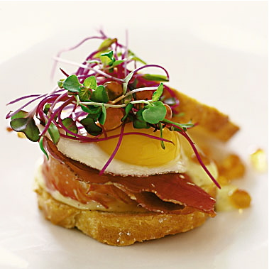

# Club sandwich

**Serves:** 2

## Ingredients
- 2 slices of bread
- soft butter
- 1 chicken breast fillet
- salt and freshly ground pepper
- 1 tablespoon olive oil
- 2 smoked bacon rashers (rinded)
- half an iceberg lettuce (shredded)
- 1 tablespoon onion (very finely chopped)
- 2 tablespoons mayonnaise (fresh)
- 2 tomatoes (thinly sliced)
- 2 tablespoons vinaigrette
- 1 teaspoon parsley (freshly chopped)
- 2 poached eggs

## Method
1. Preheat the grill to hot.
1. Butter the bread on both sides then toast it under the grill until golden brown.
1. Split the chicken breast length-ways through the middle and season with salt and pepper.
1. Grill or fry the chicken in olive oil, for a few minutes on each side until cooked.
1. Grill the bacon until crisp.
1. Mix the shredded lettuce and onion with the mayonnaise and season with salt and pepper.
1. Lay the tomato slices on top of the two pieces of toast and sprinkle with some of the vinaigrette.
1. Divide the lettuce mixture between the two and top with the bacon and chicken breast halves.
1. Sit the warmed poached eggs on the chicken breasts.
1. Mix the chopped parsley with the remaining vinaigrette, and sprinkle over the eggs.