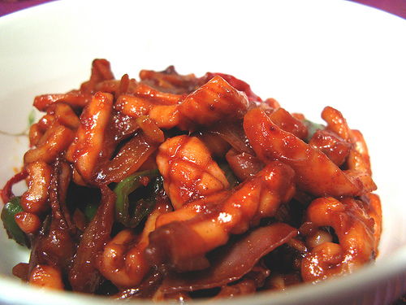

# Flash fried squid with paprika and garlic

*These quick friend squid are good served with a dry sherry as an appetizer or part of a mixed tapas. For a starter, serve them on a bed of salad leaves.*

**Serves:** 4

## Ingredients
- 500 grams very small squid (cleaned)
- 90 ml olive oil
- 1 fresh red chilli (seeded and finely chopped)
- 2 teaspoons smoked paprika
- 2 tablespoons plain flour
- 2 garlic cloves (finely chopped)
- 1 tablespoon sherry vinegar
- 1 teaspoon shredded lemon rind
- 2 tablespoons fresh parsley (finely chopped)
- salt and black pepper
- salad leaves (optional)

## Method
1. Choose small squid that are no longer than 10 cm. 
1. Cut the body sacs into rings and cut the tentacles into bite sized pieces.
1. Place the squid in a bowl and add 2 tablespoons of the oil, half the chilli and the paprika.
1. Season with a little salt and some pepper, cover and leave to marinate for 2 - 4 hours in the refrigerator.
1. Heat the remaining oil in a deep frying pan over a high heat.
vToss the squid in flour and divide into 2 batches.
1. Add the first batch of squid to the pan and stir-fry quickly, turning constantly for 1 - 2 minutes or until the squid rings become opaque and the tentacles have curled.
1. Sprinkle in half the garlic, stir to mix then turn out on to a plate and keep warm.
1. Repeat the stir-frying with the second batch of squid and garlic.
1. Sprinkle the sherry vinegar, lemon and remaining chilli and parsley over the squid.
1. Taste for seasoning and serve hot or cool.