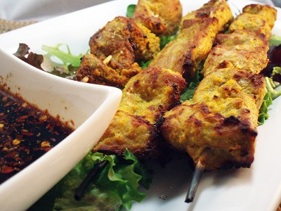

# Nonya pork satay

*There are few dishes as delicious as satay, and this dish as among one of the best satay recipes out there. The skewers of spiced meat can be served as snacks, as part of a barbecue or as a light meal.*

**Serves:** 8 - 12

## Ingredients
- 450 grams pork tenderloin
- 1 tablespoon soft light brown sugar
- 1 cm cube shrimp paste 
- 2 lemon grass stalks (trimmed)
- 2 tablespoon coriander seeds (dry fried)
- 6 blanched almonds
- 2 onions (very finely chopped)
- 4 fresh red chillies (de-seeded and very finely chopped)
- half a teaspoon ground tumeric
- 300 ml coconut milk
- 2 tablespoon peanut oil
- salt

## Method
1. Soak 8 - 12 bamboo skewers in water for at least 1 hour to prevent them from scorching 1. when they are placed under the grill.
1. Cut the pork into small chunks, then spread it out in a single layer in a shallow dish.
1. Sprinkle with the sugar to help release the juices.
1. Wrap the shrimp paste in tin foil, and dry-fry briefly or warm it on a skewer over a gas flame.
1. Cut off the lower 5 cm of the lemon grass stalks and chop very finely.
1. Put the dry-fried coriander seeds in a mortar, and grind to a powder.
1. Add the nut and chopped lemon grass and pound to a paste.
1. Transfer the paste to a food processor with the onions, chillies, shrimp paste, tumeric and a little salt and process to a smooth paste. 
1. Add the coconut milk, and briefly mix to combine.
1. Pour the mixture over the pork, stir well and leave to marinate, covered, in the refrigerator for 2 hours.
1. Preheat the grill.
1. Drain the bamboo skewers and  thread 3 - 4 pieces of marinated pork on each skewer.
1. Cook the skewered meat for 8 - 10 minutes, turning often until tender, basting frequently with the remaining marinade.
1. Serve immediately.