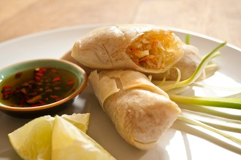

# Spring rolls with fiery chilli sauce

*This popular snack comes from South-East Asia, and would make a tasty first course. The sauce is traditionally made with hot chillies, but substitute milder ones, if you prefer.*

**Serves:** 

## Ingredients
- 25 grams cellophane noodles (soaked for 10 minutes in hot water to cover)
- 8 dried wood ears (soaked for 30 minutes in warm water to cover)
- 225 grams minced pork
- 225 grams crab meat
- 4 spring onions (finely chopped)
- teaspoon Thai fish sauce
- 250 grams spring roll wrappers
- flour and water paste (to seal spring rolls)
- vegetable oil (for frying)
- salt and freshly ground black pepper

### For the sauce
- 2 fresh red chillies (de-seeded)
- 2 garlic  cloves (chopped)
- 1 tablespoon granulated sugar
- 3 tablespoons Thai fish sauce
- juice of 1 lime (or half a lemon)

## Method
1. Make the sauce by pounding the chillies and garlic to a paste.
Scrape into a bowl and mix in the sugar and fish sauce, with the citrus juice to taste.

### To make the filling
1. Drain the noodles and snip them into 2.5 cm lengths.
1. Drain the wood ears, trim away any rough stems and slice the caps finely.
1. Mix with the noodles.
1. Mix the noodles and wood ears with the pork and set aside.
1. Remove any cartilage from the crab meat and add to the pork mixture, along with the spring onions and dish sauce.
1. Season to taste, mixing well.

### To make the spring rolls
1. Place a spring roll wrapper in front of you, diamond-fashion.
1. Spoon some mixture just below the centre, across the width.
1. Fold over the nearest point and roll once.
1. Fold in the sides to enclose the mixture, then brush the edges with flour paste and roll up to seal.
1. Repeat with the remaining spring roll wrappers and filling mixture.

### To cook
1. Heat the oil in a wok or deep-fryer to 190°C.
1. Deep fry the rolls in batches fro 8 - 10 minutes, and drain on kitchen paper.

**Notes**
*Wood ears (Chinese black fungus) is a gelatinous species collected and cultivated in China.*

*Serve the rolls Vietnamese-style by wrapping each one in a lettuce leaf with a few sprigs of fresh mint and coriander.*