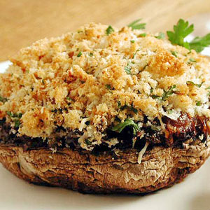

# Stuffed portobello mushrooms

*This wonderfully aromatic stuffed mushroom is particularly good as a starter or a side dish.*

**Serves:** 2

## Ingredients
- 4 portobello mushrooms
- 150 grams Brie-style blue cheese (diced)
- 50 grams fresh bread crumbs
- small bunch of parsley (finely chopped)
- 5 cloves garlic (peeled and finely chopped)
- olive oil (for drizzling)

## Method
1. Preheat the oven to 180°C.
1. Put the mushrooms on a foil-lined baking sheet and sprinkle over the diced cheese.
1. Mix together the breadcrumbs, parsley and garlic. 
1. Season with a salt and pepper. 
1. Spoon on to the mushrooms and cheese, drizzle over a little olive oil and bake for 20 minutes, until the mushrooms are soft and the cheese has melted.