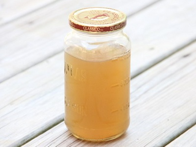

# Balti chicken stock

*After filleting a dressed bird, there is still plenty of goodness left. It can be made into a Balti stock. This recipe used a dressed roasting chicken weighing about 1.8 kg.*

*Once made, the stock should be poured into yoghurt pots (200 ml) and frozen.*

**Yield:** 900ml

## Ingredients
- 1 oven ready chicken about 1.8 kg
- 6 garlic cloves (quartered)
- 100 grams onion (coarsely sliced)
- 4 bay leaves
- 1 tablespoon Balti masala paste
- 2 celery sticks (chopped)
- 1 large carrot (chopped)
- 1 tablespoon sugar
- 1 teaspoon salt
- 1 litre water

## Method
1. Using a sharp knife, remove and discard the skin from the carcass.
1. Using a cleaver, remove the legs and the thighs at the joint.
1. Using a sharp knife remove the two breasts, and set the removed meat aside for either cooking or freezing.
1. Put the carcass with all the remaining ingredients into a pot and bring to the boil.
1. Immediately reduce the heat to very low, maintain a very slow rolling simmer for 30 minutes.
1. Skim the surface for any impurities.
1. Check, and add more water if needed. Do not be tempted to stir the stock at all, as this will introduce impurities into the stock.
1. Continue to simmer for 30 more minutes, skimming the surface as necessary.
1. Carefully remove the carcass and vegetables from the stock using a slotted spoon.
vDrain the stock through a damp muslin-lined chinois or fine-meshed conical sieve into a clean pot.
1. Leave to cool.
1. Once cooled, skim any fat from the surface and strain once again into 200 ml pots and freeze.