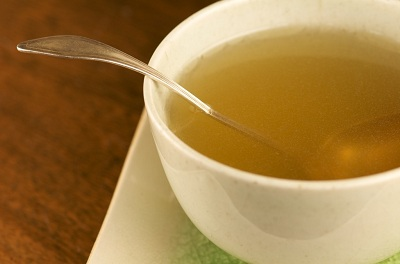

# Chinese chicken stock

*This Chinese chicken stock is an all-purpose base, not only for soups but also for sauces and glazes. It is light and delicious, and easy to make.*

*A good stock requires meat to give it richness and flavour. It is therefore necessary to use at lease some chicken meat, if not a whole bird.*

*The stock should never boil. If it does it will become undesirably cloudy and the fat will become incorporated into the liquid. Simmer the stock slowly, and if possible use a diffuser to decrease the heat, making sure you skim the surface of the stock regularly. When the stock is finished, it should be passed through several layers of damp muslin.*

**Yield:** 3 litres

## Ingredients
- 2 kg uncooked chicken bones
- 700 grams chicken pieces
- 3 litres cold water
- 2 slices fresh ginger
- 2 spring onions
- 2 garlic cloves (unpeeled)
- ½ teaspoon salt

## Method
1. Put the chicken pieces and bones into a very large pot.
1. Pour enough water into the pot to barely cover the chicken pieces and bones.
1. Put the pot over a medium heat and slowly bring to a simmer, making sure that the water does not boil.
1. Meanwhile, cut the ginger into diagonal slices.
1. Lightly crush the garlic cloves, leaving the skins on.
1. Using a large, flat spoon, skim the surface of the water, lifting off an scum that rises from the bones. Do not stir the stock.
1. Watch the heat of the water as the stock should never boil.
1. Keep simmering and skimming until the stock looks clear.
1. This can take from 20 - 40 minutes.
1. Do not stir or disturb the stock.
1. Add the ginger, spring onions, garlic cloves and salt.
1. Reduce the heat to very low, if possible use a diffuser and simmer the stock for between 2 and 4 hours, skimming the surface as necessary.
1. Strain the stock through a muslin-lined conical sieve, set over a clean bowl.
1. Leave the stock to cool thoroughly, and remove any fat that has risen to the surface.
1. This stock can then be used straight away, or frozen.