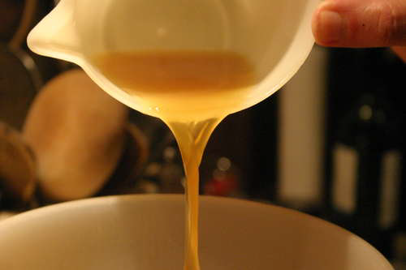

# White chicken stock (Fond blanc de volaille)

*This stock is an important ingredient of the light sauces served with white meats and of creamed vegetables and veloutés.*

**Yield:** 1.5 litres

## Ingredients
- 1.5 kilograms chicken wings (blanched)
- 200 grams carrots (cut into chunks)
- 2 leeks (white parts only, cut into chunks)
- 1 stalk of celery (coarsely chopped)
- 1 onion (studded with 2 cloves)
- 150 grams button mushroom (thinly sliced)
- 1 Bouquet garni

## Method
1. Put the chicken into a saucepan and cover with 2.5 litres cold water. 
1. Bring to the boil over a high heat, then immediately lower the heat and keep at a simmer.
1. After 5 minutes, skim the surface and add all the other ingredients. 
1. Cook gently for 1 1/2 hours, without boiling, skimming whenever necessary.
1. Strain the stock through a fine-meshed conical sieve into a bowl and cool over ice.