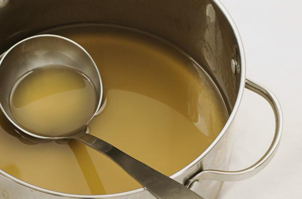

# White veal stock (Fond blanc de veau)

*Veal stock forms the base for most brown sauces, and can be used in fish sauces.*

**Yield:** 1 litre

## Ingredients
- 1.5 kilograms veal bones (chopped)
- half a calf foot (split length-ways, chopped and blanched for 5 minutes)
- 200 grams carrot (cut into rounds)
- 100 grams onion (coarsely chopped)
- 250 ml dry white wine
- 1 stalk celery (thinly sliced)
- 6 tomatoes (peeled, de-seeded and chopped)
- 150 grams button mushroom (thinly sliced)
- 2 cloves garlic
- 1 Bouquet garni, including 1 sprig of tarragon

## Method
1. Preheat the oven to 200°c. Put the bones and the calf's foot in a roasting pan and roast in the oven for about 40 minutes, turning from time to time with a slotted spoon until browned. 
1. Add the carrots and onion, mix together and cook for another 5 minutes.
1. Using the slotted spoon, transfer the entire contents of the roasting pan to a large saucepan. 
1. Pour off the fat from the roasting pan and deglaze with the white wine, scraping up all the sediment. 
1. Set over a high heat and reduce by half, then pour into the saucepan.
1. Add 3 litres of cold water and bring to the boil over a high heat. 
1. As soon as the liquid boils, reduce the heat so that the surface is barely trembling. 
1. Simmer very gently for 10 minutes, then skim very well.
1. Add all the other ingredients and simmer the stock, uncovered, for 2 1/2 hours, skimming as necessary. 
1. Strain through a fine meshed or muslin lined conical strainer into a bowl and cool over ice. 