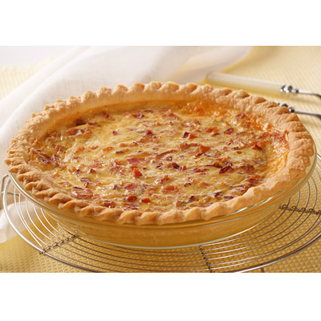

# Quiches lorraine

*A salad of frisée with some garlic flavoured croûtons is the perfect accompaniment to these delicate little quiches.*

**Serves:** 6

## Ingredients
- 375 grams [shortcrust pastry](../../baking/pastry/shortcrust-pastry.md)
- 140 grams lardons
- 1 egg
- 3 egg yolks
- 300 ml double cream
- pinch freshly grated nutmeg
- salt and freshly ground pepper
- 140 grams Gruyère or Comté (freshly grated)

## Method
### Making the flan cases
1. Roll out the pastry to a 2 mm thickness.
1. Using a 16 cm cutter or plate as a guide, cut out 6 rounds.
1. Use these to line 6 individual loose-bottomed quiche tins, 10 cm in diameter and 3 cm deep.
1. Chill for 20 minutes.

### Baking blind
1. Preheat the oven to 190°C.
1. Prick the pastry bases with a fork.
1. Line the pastry cases with greaseproof paper, and fill with a layer of baking beans.
1. Bake the cases blind in the oven for 15 minutes.
1. Lower the oven temperature to 170°C.
1. Remove the paper and the beans and return the pastry cases to the oven for 5 minutes.
1. Leave the pastry cases in the tins to cool.

### Making the filling
1. Put the whole egg and yolks in a bowl, mix in the cream with a whisk and season with the nutmeg, salt and pepper.
1. Divide the lardons and grated cheese between the pastry cases, then fill to the brim with the egg mixture.

### Baking the quiches
1. Put the pastry cases, still in their tins into the oven and bake for 15 minutes.
1. Leave to cool slightly then unmould the quiches onto a wire rack, then transfer to individual plates and serve.
