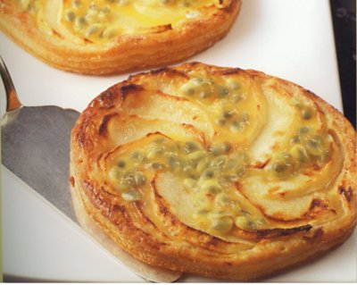

# Apple and passion fruit tartlets

*The passion fruit in these tartlets enhances the flavour of the apple in a most unexpected way.*

*To enjoy these tartlets at their best, serve them warm, about 10 minutes after they come out of the oven.*

**Serves:** 6

## Ingredients
- 380 grams [classic puff pastry](../../baking/pastry/puff-pastry.md)
- 180 grams [crème pâtissière](../../baking/cremes/creme-patissiere.md)
- 3 medium apples (preferably Cox's)
- 60 grams caster sugar
- 3 passion fruit

## Method
### Prepare the pastry
1. On a lightly floured surface, roll the pastry to a 2 mm thickness.
1. Using a 12 cm pastry cutter, cut out 6 discs.
1. Brush a baking sheet with a little cold water and lift the pastry discs onto it with a palette knife.
1. Refrigerate for 20 minutes.

### Make the tartlets
1. Preheat the oven to 180°C.
1. Prick the pastry discs in 5 places with a fork.
1. Divide the crème pâtissière between them and spread it evenly, leaving a narrow margin around the edge.
1. Peel the apples with a swivel peeler.
1. Cut in halves and remove the cores.
1. Thinly slice the apples.
1. Arrange a sliced apple half over the crème pâtissière on each disc, radiating from the centre.

### Bake the tartlets
1. Bake in the oven for 15 minutes, then sprinkle generously with the caster sugar and cook for another 5 minutes.
1. Take the tartlets out of the oven and immediately lift them onto a wire rack with a palette knife.
1. Halve the passion fruit and scrap out the pulp and seeds, using a teaspoon, directly onto the tartlets.