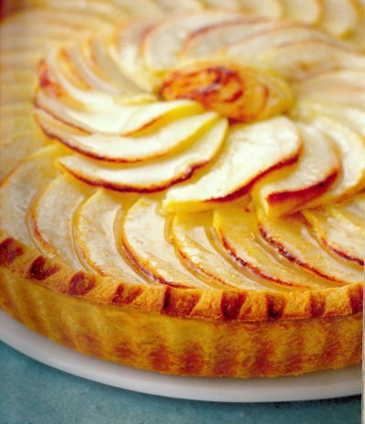

# Apple tart

*This tart is truly delicious if it is eaten barely cool from the oven. Serve this with a quenelle of extra thick or clotted cream.*

**Serves:** 8

## Ingredients
- 300 grams [shortcrust pastry](../../baking/pastry/shortcrust-pastry.md)
- 6 dessert apples (preferably Cox's)
- 1 vanilla pod (split length ways)
- 60 grams butter
- 80 grams caster sugar

## Method
### Prepare the pastry
1. Roll out the pastry to a round, 3 mm thick, and use to line a lightly buttered 24 cm diameter (3 mm deep) loose-bottomed tart tin or flan ring.
1. Pinch up the edges of the pastry with your index finger and thumb at 1 cm intervals to make a fluted edge a little higher than the rim.
1. Chill the pastry in the fridge for 20 minutes.

### Create the filling
1. Preheat the oven to 200°C.
1. Peel, core and halve the apples.
1. Place cut-side down on a board and cut into 2 mm thick slices.
1. Put a third of the apples (the outer smaller slices) into a saucepan.
1. Keep the other two-thirds packed together (to stop them discolouring).
1. Add 50 ml water, the vanilla pd and butter to the apples in the pan and cook gently until tender.
1. Take off the heat, discard the vanilla pod and work the apples, using a whisk, to a compote consistency.
1. Leave the apples to cool.

### Create the glaze
1. In a small pan, dissolve the sugar in 40 ml water.
1. Bring to the boil and bubble for 4 - 5 minutes to make a syrup.
1. Leave to cool.

### To arrange the tart
1. Prick the base of the pastry case lightly with a fork.
1. Pour in the cold apple compote and spread gently with the back of a spoon.
1. Arrange a border of overlapping apple slices around the tart, then arrange another circle inside, with the slices facing the other way.
1. Fill the centre with a little rosette of small apples slices, trimming to fit as necessary.
1. Bake for about 35 minutes until the pastry and apples are evenly cooked to a light golden colour.

### To glaze the tart
1. Leave the tart to cool for at least 20 minutes before removing the flan ring or tart tin.
1. Brush the top of the tart with the glaze.
1. Place the tart on a wire rack and leave until just cooled.
1. Transfer to a plate and serve cut into slices.