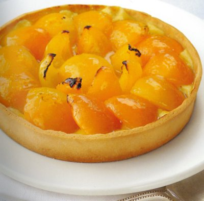

# Apricot tart

*This vibrant tart is a lovely way to enjoy fresh apricots during their short season, at other times you can use tinned fruit.*

**Serves:** 6

## Ingredients
- 220 grams [Sweet shortcrust pastry](../../baking/pastry/sweet-short-pastry.md)
- 350 grams [crème pâtissière](../../baking/cremes/creme-patissiere.md)
- 8 very ripe apricots (halved and stoned)
- 80 grams caster sugar

## Method
### Prepare the pastry
1. Roll out the pastry to a round, 2 -  3 mm thick, and use to line a lightly greased 18 cm diameter (2.5 cm deep) flan ring.
1. Chill the pastry in the refrigerator for 20 minutes.

### Blind bake the pastry
1. Preheat the oven to 190°C.
1. Prick the pastry base with a fork.
1. Line the pastry case with greaseproof paper, and fill with a layer of baking beans.
1. Bake the pastry case blind in the oven for 20 minutes.
1. Remove the paper and the beans and return the pastry case to the oven for 5 minutes.
1. Set the pastry aside to cool.
1. Increase the oven temperature to 200°C.

### Make the filling
1. Use a spoon to spread the crème pâtissière evenly in the pastry case.
1. Arrange 12 apricot halves around the edge, rounded side up and overlapping slightly.
1. Place a good apricot half in the centre of the tart.
1. Cut the remaining apricot halves in tow and arrange the, standing upright, all around the central apricot like flower petals.

### Baking the tart
1. Bake the tart in the oven for 20 minutes

### Assemble the tart
1. Meanwhile, put 80 ml of water in a small saucepan, add the sugar and heat to dissolve, then bring to the boil.
1. Let bubble for 5 minutes to make a syrupy glaze.
1. When the tart is ready, transfer it to a wire rack and lift off the flan ring.
1. Let it cool for a minute or two, then brush generously with the syrup to glaze.