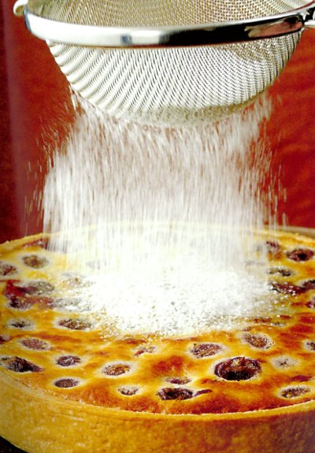

# Cherry clafoutis

*This traditional French dessert is a lovely way to serve soft stone fruit. It also works well with apricots, mirabelles or greengage. Adding a splash of kirsch enhances the flavour of the fruit.*

**Serves:** 6

## Ingredients
- 240 grams pâte brisée
- 1 egg
- 40 grams plain flour
- 40 grams butter (melted and cooled slightly)
- 1 tablespoon kirsch (optional)
- 30 grams caster
- 75 ml cold milk
- 1 vanilla pod (split length ways)
- 450 grams very ripe black cherries (pitted)
- icing sugar (to dust)

## Method
1. Break the egg in a bowl, add the flour and mix using a whisk, without overworking.
1. Add the melted butter and kirsch (if using), then gradually work in the caster sugar and milk.
1. Scrape the vanilla seeds from the pod with the tip of a knife and stir into the mixture.

### Prepare the pastry
1. Roll out the pastry to a round, 3 mm thick, and use to line an 18 cm diameter (2.5 cm deep) flan ring.
1. Chill the pastry in the refrigerator for at least 20 minutes.

### Blind bake the pastry
1. Preheat the oven to 170°C.
1. Prick the base of the pastry case,
1. Line the pastry case with greaseproof paper, and fill with a layer of baking beans.
1. Bake the case blind in the oven for 15 minutes.
1. Increase the oven temperature to 180°C.
1. Remove the paper and the beans and return the pastry case to the oven for 5 minutes.
1. Leave the pastry case in the flan ring to cool.

### Bake the tart
1. Increase the oven temperature to 200°C.
1. Spread the cherries evenly in the pastry case, then pour in the batter to come just up to the rim.
1. Bake in the hot oven for about 25 minutes, until the surface is a light hazelnut brown colour.
1. Check by gently inserting a knife tip in the centre, if it comes out clean, the clafoutis is done.
1. Slide onto a wire rack and lift off the flan ring.
1. Transfer the clafoutis to a serving plate, dust generously with icing sugar and serve warm.