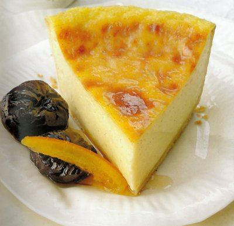

# Sweet custard tart with poached prunes

*You'll comes across versions of this sweet custard tart or flan boulanger in baker's shops all over France.*

*This tart is especially delicious when served with poached prunes and candied citrus peel.*

**Serves:** 6

## Ingredients
- 260 grams [flan pastry](../../baking/pastry/flan-pastry.md)
- 5 egg yolks
- 100 grams caster sugar
- 20 grams plain flour
- 15 grams custard powder
- 400 ml milk
- 1 vanilla pod (split length ways)

### To serve
- 16 prunes (pitted)
- 150 grams caster sugar
- 100 grams candied citrus peel

## Method
### Prepare the pastry
1. Roll out the pastry to a round, 3 mm thick, and use to line a 20 cm diameter (3.5 cm deep) flan ring.
1. Crimp the pastry border with your index finger and thumb.
1. Chill in the refrigerator for at least 20 minutes.

### Blind bake the pastry
1. Preheat the oven to 190°C.
1. Prick the pastry base with a fork.
1. Line the pastry case with greaseproof paper, and fill with a layer of baking beans.
1. Bake the case blind in the oven for 15 minutes.
1. Leave the pastry in the flan ring to cool.
1. Increase the oven temperature to 200°C.

### Make the filling
1. Whisk the egg yolks with one-third of the sugar in a bowl.
1. Add the flour and custard powder and whisk thoroughly.
1. Heat the milk with the rest of the sugar and the vanilla pod in a heavy-based pan.
1. As soon as it comes to the boil, pour onto the egg yolk mixture, stirring well.
1. Return the custard mixture to the pan.
1. Bring to the boil over a medium heat, stirring continuously with a whisk.
1. Allow the custard to bubble very gently, still stirring for 2 minutes.
1. Remove the vanilla pod.

### Make the tart
1. Spread the hot custard in the flan case and bake for 25 minutes or until lightly golden on the surface.
1. Carefully slide on a wire rack, lift off the ring and leave to cool completely.

### Poach the prunes
1. Dissolve the sugar in 150 ml of water in a pan over a medium heat.
1. Add the prunes and poach gently for 2 - 6 minutes until tender.
1. Serve the tart with the poached prunes and candied orange peel.