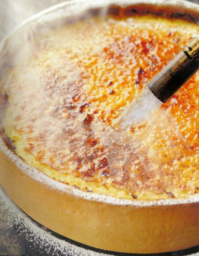

# Lemon tart

*This classic tart tastes even better if you make it in advance, and caramelise the surface using a cook's blowtorch.*

**Serves:** 8

## Ingredients
- 280 grams [Sweet Shortcrust](../../baking/pastry/sweet-short-pastry.md)
- eggwash (1 egg yolk mixed with 1 tablespoon milk)
- 5 unwaxed lemons (washed)
- 9 eggs
- 375 grams caster sugar
- 300 ml double cream (lightly whipped)
- 30 grams icing sugar (to glaze)

## Method
### Prepare the pastry
1. Roll out the pastry to a round, 3 mm thick, and use to line a lightly greased 20 cm diameter (4 cm deep) flan ring.
1. Chill the pastry in the refrigerator for 20 minutes.

### Blind bake the pastry
1. Preheat the oven to 180°C.
1. Prick the pastry base with a fork.
1. Line the pastry case with greaseproof paper, and fill with a layer of baking beans.
1. Bake the pastry case blind in the oven for 20 minutes.
1. Remove the paper and the beans and return the pastry case to the oven for 15 minutes.
1. Lower the oven temperature to 170°C.
1. Set the pastry case aside to cool, and then brush the inside of the case with eggwash and return to the oven for 5 minutes.
1. Lower the oven temperature to 150°C.

### Make the filling
1. Finely grate the zest from the lemons and set aside.
1. Squeeze the juice from the lemons and strain through a chinois or fine-meshed conical sieve to eliminate the pulp and pips.
1. Combine the eggs and sugar together in a bowl, stirring with a whisk until thoroughly amalgamated.
1. Pour on the lemon juice and add the zest, stirring all the time.
1. Finally, delicately fold in the whipped cream, making sure not to overwork the mixture.
1. Cover the bowl and chill in the refrigerator for 30 minutes.

### Assemble the tart
1. Lightly beat the cold lemon cream with a spatula before pouring into the pastry case.
1. Immediately bake the tart for 1 hour and 20 minutes.
1. Leave to cool and firm up before removing the ring.
1. Set aside until cold.

### Serve
1. Dust the surface with half of the icing sugar and caramelise it with a cook's blowtorch.
1. Repeat with the remaining icing sugar and serve immediately.
1. Cut the tart carefully with a very sharp knife, as the caramelised surface is very delicate.