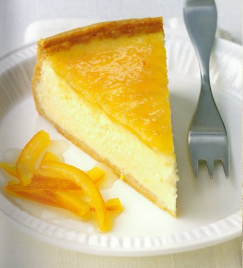

# Orange cheesecake tart

*This luxury cheesecake is made in a pastry case rather than with a biscuit base, but none the less it is still an elegant tart with a delicious mouth-watering finish.*

**Serves:** 8

## Ingredients
- 280 grams [shortcrust pastry](../../baking/pastry/shortcrust-pastry.md)
- 4 oranges
- 350 grams fromage frais
- 350 grams curd cheese
- 150 grams soured cream
- 175 grams caster sugar
- 4 eggs

### To finish
- 6 tablespoons Seville orange marmalade (warmed and strained)
- candied orange peel 

## Method
### Prepare the pastry
1. Roll out the pastry to a round,  3 mm thick, and use to line a lightly greased 20 cm diameter (4 cm deep) flan ring.
1. Chill the pastry in the refrigerator for 20 minutes.

### Blind bake the pastry
1. Preheat the oven to 170°C.
1. Prick the pastry base with a fork.
1. Line the pastry case with greaseproof paper, and fill with a layer of baking beans.
1. Bake the pastry case blind in the oven for 30 minutes.
1. Remove the paper and the beans and return the pastry case to the oven for 5 minutes.
1. Set the pastry aside to cool.
1. Lower the oven temperature to 140°C.

### Make the filling
1. Finely grate the zest from the oranges, then squeeze the juice and strain through a chinois or fine-meshed conical sieve.
1. Put the soft cheeses, soured cream and sugar in a large bowl and mix thoroughly with a spatula.
1. In another bowl, whisk the eggs until frothy, then delicately incorporate them into the cheese mixture.
1. Add the orange zest and juice and mix with a spatula until evenly combined.

### Baking the tart
1. Pour the filling into the pastry case and bake in the low oven for 90 minutes.
1. To check the cheesecake is cooked, insert a fine skewer into the centre; it should come out clean.
1. Place on a wire rack and leave to cool for about 20 minutes before removing the flan ring.
1. Let cool completely, then place in the least cool part of the refrigerator until ready to serve.

### Serving
1. Carefully spread an even layer of marmalade over the surface of the cheesecake.
1. Wait a few minutes for the glaze to set, then cut the cheesecake into portions using a very sharp knife.
1. Serve on individual plates, with candied orange peel.