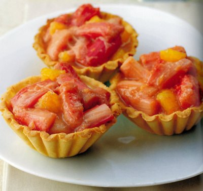

# Rhubarb tartlets with orange

*The flavours of orange and rhubarb work well together and the crème pâtissière counteracts their acidity perfectly. *

*Don't fill the tartlet cases too soon before serving, or the syrup will soften the pastry.*

**Serves:** 6

## Ingredients
- 220 grams [Sweet shortcrust pastry](../../baking/pastry/sweet-short-pastry.md)
- 400 grams tender young rhubarb
- 140 grams caster sugar
- 1 large juicy orange
- 40 grams butter
- 120 grams [crème pâtissière](../../baking/cremes/creme-patissiere.md)

## Method
### Prepare the pastry
1. Roll out the pastry to a 3 mm thickness.
1. Using a 12 cm cutter or plate as a guide, cut out 6 rounds.
1. Use these to line 6 tartlet tins, 6 cm in diameter and 3 cm deep.
1. Cut off the excess pastry with a sharp knife.
1. Rest the tartlet cases in the refrigerator for 20 minutes.

### Blind bake the pastry
1. Preheat the oven to 180°C.
1. Prick the pastry base with a fork.
1. Line the pastry case with greaseproof paper, and fill with a layer of baking beans.
1. Bake the pastry case blind in the oven for 15 minutes.
1. Remove the paper and the beans and return the pastry case to the oven for 5 minutes.
1. Leave the pastry to rest for 5 minutes, then unmould onto a wire rack.

### Poaching the rhubarb
1. Peel any stringy bits from the rhubarb.
1. Halve the stalks length ways if large, then cut into 2 cm lengths.
1. Place the rhubarb in a saucepan and barely cover with watter.
1. Add 100 grams of the sugar and heat to dissolve.
1. Bring the water to the boil, then immediately lower the heat and simmer for 5 minutes.
1. Leave the rhubarb to cool in the syrup for 10 minutes.
1. Drain the rhubarb well through a sieve, reserving the liquor.
1. Return the liquor to the pan and boil to reduce until thick and syrupy.

### Making the filling
1. Peel the orange with a flexible knife, removing all the white pith.
1. Slide the knife blade between each segment to release it from the membrane, then cut the segments in half.
1. Heat the butter in a frying pan, sprinkle on the remaining 40 grams of sugar and cook for a few minutes, stirring with a wooden spoon to make a light caramel.
1. Add the rhubarb and glaze it in the caramel for 2 - 3 minutes.
1. Add the orange segments and finally the reduced poaching syrup.
1. Simmer for 2 minutes, then tip into a bowl and leave to cool.

### Serving
1. Divide the crème pâtissière between the tartlet cases and pile the rhubarb and oranges on top.