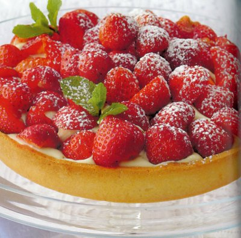

# Strawberry tart

*For this tart filling, the crème pâtissière should be strongly flavoured with vanilla or, better still, the grated zest of 2 oranges.*

*Assemble the tart just before serving to enjoy it at its best.*

**Serves:** 6

## Ingredients
- 250 grams [Sweet shortcrust pastry](../../baking/pastry/sweet-short-pastry.md)
- 750 grams very ripe fragrant strawberries
- 300 grams [crème chantilly ](../../baking/cremes/creme-chantilly.md)
- 150 grams [crème pâtissière](../../baking/cremes/creme-patissiere.md)
- a few mint sprigs
- icing sugar (to dust)

## Method
### Prepare the pastry
1. Roll out the pastry to a round, 2 - 3 mm thick and use to line an 18 cm diameter (2.5 cm deep) flan ring.
1. Rest the pastry in the refrigerator for 20 minutes.

### Blind bake the pastry
1. Preheat the oven to 190°C.
1. Prick the pastry base with a fork.
1. Line the pastry case with greaseproof paper, and fill with a layer of baking beans.
1. Bake the pastry case blind in the oven for 25 minutes.
1. Remove the paper and the beans and return the pastry case to the oven for 15 minutes.
1. Leave the pastry to rest for 5 minutes, then unmould onto a wire rack.

### Making the filling
1. Halve the strawberries if they are large.
1. Delicately fold the crème chantilly into the crème pâtissière and fill the pastry case with this mixture.
1. Arrange the strawberries in top, heaping them up slightly in the centre.

### Serving
1. Slide the tart onto a serving plate, decorate with mint sprigs and dust lightly with icing sugar to serve.