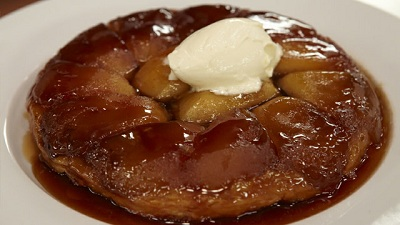

# Tart tatin

**Serves:** 8 - 10

## Ingredients
- For the pastry
- 320 grams plain flour
- 225 grams ice-cold butter
- 110 grams icing sugar
- 3 free-range egg yolks

### For the filling
- 6 Cox or 4 Granny Smith apples (peeled, cored and cut into 8-12 wedges)
- ¼ lemon
- 110 grams caster sugar
- 110 grams butter

## Method
1. Preheat the oven to 250°C
1. First, make the pastry. In a food processor, mix the flour, butter and icing sugar just until they resemble breadcrumbs. 
1. Add the egg yolks and, using the pulse button, mix until it comes together in a dough.
1. Remove the dough from the mixer bowl and divide into two pieces. 
1. Wrap in cling-film and put in the freezer to chill for at least an hour.
1. For the filling, place the apple wedges in a bowl, squeeze the lemon juice over them and toss them gently.
1. Sprinkle 85 grams of the sugar in a heavy-bottomed pan and place on the hob over a medium heat, turning the pan frequently and making sure the sugar doesn't burn. 
1. Allow the sugar to caramelise a little and become a pale golden brown, then remove from the heat and arrange the drained apple pieces in one layer over the bottom of the pan.
1. Place the pan in the oven and bake until the apples have softened a bit and started to release some liquid - about 10 minutes.
1. Remove from the oven and sprinkle over the remaining sugar and dot the butter on top.
1. Remove the pastry from the freezer and, using the coarse side of a cheese grater, grate the pastry with long steady strokes over the apples until it forms an even layer at least 2.5 cm thick. Do not press down. 
1. Return to the oven, turn the heat down to 220°C and bake until the pastry is golden brown - about 20 minutes. Remove from the oven and leave to rest for a minute or two.
1. Take a heatproof serving dish that is generously larger than the pan on all sides and place over the pan. 
1. Protecting your hands with a dry folded tea-towel, and holding the dish and pan firmly together, quickly and carefully flip the pan and the dish so that the pan is on top. 
1. Tap the pan sharply a few times all round with a wooden spoon, then lift off.
1. The tart should be left on the serving dish with the apple on top.
