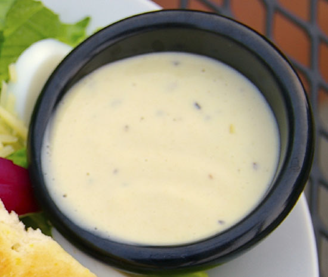

# Caesar dressing

*The classic dressing for a Caesar salad, this is most suited to robust salad leaves, such as Cos.*

**Yield:** 6 servings

## Ingredients
- 1 egg yolk
- ⅛ teaspoon Dijon mustard
- 1 tablespoon lemon juice
- ⅛ clove garlic (crushed)
- 1 tablespoon anchovy essence (or 15 grams anchovy fillets, chopped)
- 75 ml groundnut oil
- 30 grams Parmesan cheese)
- salt and pepper (to taste)

## Method
1. In a bowl, mix the egg yolk, mustard, lemon juice and garlic with a small whisk until smooth.
1. Add the anchovy essence, then slowly whisk in the oil until amalgamated.
1. Add the Parmesan, and finally whisk in 2 tablespoons of water to give a slightly looser consistency.
1. Season with salt and pepper to taste.