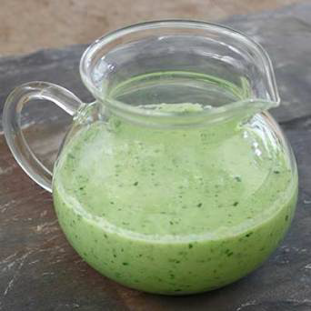

# Cucumber vinaigrette

*This fresh-tasting vinaigrette is lovely in summer with crisply cooked green beans or thinly sliced button mushrooms.*

**Yield:** 4

## Ingredients
- 250 grams cucumber
- 60 grams shallots (finely chopped)
- 1 teaspoon chives (snipped)
- 1 teaspoon tarragon (snipped)
- 1 teaspoon flat leaf parsley (snipped)
- 6 tablespoons olive oil
- 2 tablespoons rice wine vinegar
- salt and pepper (to taste)

## Method
1. Peel the cucumber with a potato peeler, halve it length-ways and scoop out the seeds, then slice as thinly as possible using a mandolin.
1. Place in a bowl with the remaining ingredients, toss to combine and season with salt and pepper.