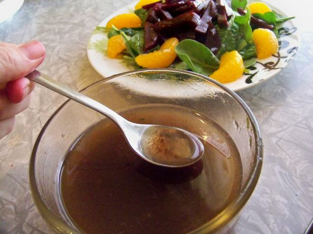

# French Vinaigrette

*This is the classic French Vinaigrette.*

**Yield:** 4

## Ingredients
- 1 teaspoon Dijon mustard
- 1 tablespoon red wine vinegar (or white wine vinegar)
- 3 tablespoons groundnut oil (or mix sunflower, grape-seed to lighten the vinaigrette)
- salt and pepper

## Method
1. Put the mustard in a bowl with salt and pepper to taste. Whisk together, then pour in the vinegar as you whisk.
1. Finally add the oil in a steady stream, whisking all the time. 
1. Taste and adjust the seasoning, and add a few more drops of vinegar if you feel it is needed.