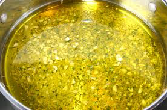

# Lemon and mint vinaigrette

*This vinaigrette is perfect with watercress*

**Yield:** 6

## Ingredients
- 2 lemon zest
- 2 lemon juice
- 6 tablespoons groundnut oil
- 6 mint leaves (snipped)
- salt and pepper (to taste)

## Method
1. Whisk together all of the ingredients except the mint leaves, leaving these to scatter over the vinaigrette before serving.