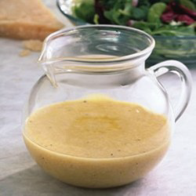

# Parmesan vinaigrette

*This vinaigrette goes well with raw chicory, spinach or sliced mushrooms*

**Yield:** 6

## Ingredients
- 1 teaspoon English mustard powder
- 2 tablespoons Champagne wine vinegar
- 6 tablespoons double cream
- 30 grams Parmesan cheese (grated)
- 1 tablespoon chives (snipped)
- salt and pepper (to taste)

## Method
1. In a bowl mix together the mustard powder and the vinegar, then whisk in the remaining ingredients.
1. Add seasoning to taste and a little warm water to thin if necessary.