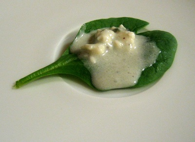

# Roquefort vinaigrette

*This dressing is particularly good with bitter winter leaves or crisply cooked warm French beans.*

**Yield:** 6

## Ingredients
- 3 tablespoons walnut oil
- 3 tablespoons sunflower oil
- 2 tablespoons tarragon vinegar
- 50 grams Roquefort cheese (crumbled)
- 1 teaspoon tarragon leaves (snipped)
- Worcestershire sauce (to taste)
- salt and pepper (to taste)

## Method
1. In a bowl whisk together the ingredients and add a few drops of Worcestershire sauce to taste