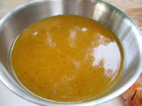

# Saffron vinaigrette

*A lovely dressing for a salad of tender leaves, garnished with scallops or warm langoustine tails.*

**Yield:** 6

## Ingredients
- 3 tablespoons white wine vinegar
- 1 pinch saffron threads
- 6 tablespoons groundnut oil
- 1 tablespoon sesame oil
- 1 teaspoon soy sauce
- 1 pinch cayenne pepper (to taste)
- salt (to taste)

## Method
1. In a small saucepan, warm the vinegar and add the saffron threads, turn off the heat and leave to infuse until cold.
1. Whisk the remaining ingredients into the vinegar and add salt and the cayenne to taste.