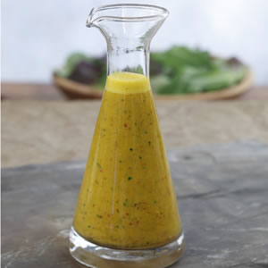

# Thai vinaigrette with lemon grass

*This refreshing vinaigrette is ideal for crisp leaves like Cos or as a dressing for noodles.*

**Yield:** 10

## Ingredients
- 4 cm lemon grass
- 15 grams coriander leaf (finely shredded)
- 10 grams chives (finely snipped)
- 2 tablespoons Fish sauce
- 1 tablespoon soy sauce
- 200 ml sunflower oil
- 75 ml rice wine vinegar

## Method
1. Whisk to combine all of the ingredients, adding seasoning to taste.
1. Cover and infuse for 2 hours before using.