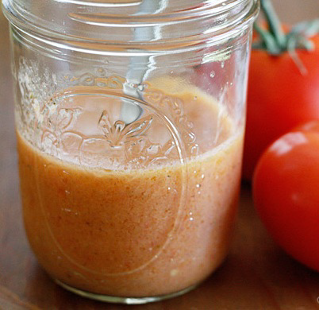

# Tomato vinaigrette

*A good dressing for fresh pasta or rice salad.*

**Yield:** 6

## Ingredients
- 150 ml tomato juice (pressed from fresh tomatoes)
- 50 ml olive oil
- 50 ml sherry vinegar
- 5 grams basil leaves (snipped)
- salt (to taste)
- cayenne pepper (to taste)

## Method
1. Mix together the ingredients very gently in a bowl and add the salt and cayenne to taste.